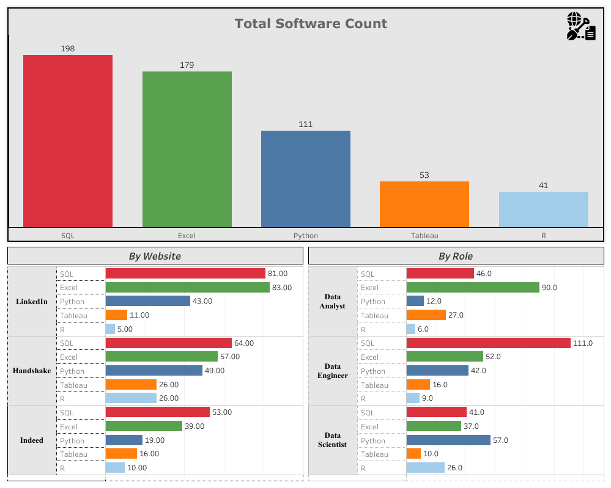

# Author
- [Vinh Van](https://github.com/MorphingGrid)

#  Insights at a Glance:  
Data Analysts and Data Engineering Roles stress more on data cleaning and database management skills such as Excel and SQL whereas Data Scientists require a much more Software oriented and well rounded background. Many Data Analyst Roles didn't even list a programming lanauge as required whereas Data Scientists often required knowing Python as a bare minimum.  
## Most Popular Software Overall:  
**SQL**  
## Most Popular Software by Role  
Data Analyst: **Excel**  
Data Engineers: **SQL**  
Data Scientists: **Python** 

# Tableau Dashboard 

### Interactive dashboard can be found [here](https://public.tableau.com/app/profile/vinh.van/viz/JobPostingWebScraper/Dashboard1)

# Table of Contents

  - [Data Problem](#data-problem)
  - [Tech Stack](#tech-stack)

## Data Problem
This Automated Bot will scrape the top job postings of popular job sites such as Indeed, LinkedIn and Handshake to record and collect the frequency of key tech stacks such as Excel, Python and SQL etc etc. The project aims to provide valuable insights into common industry practices. The gathered data will help narrow the scope of future projects and guide the identification of essential skills necessary for success in the field. Through this analysis, the project seeks to enhance decision-making and optimize learning strategies for career advancement.

## Tech Stack  
